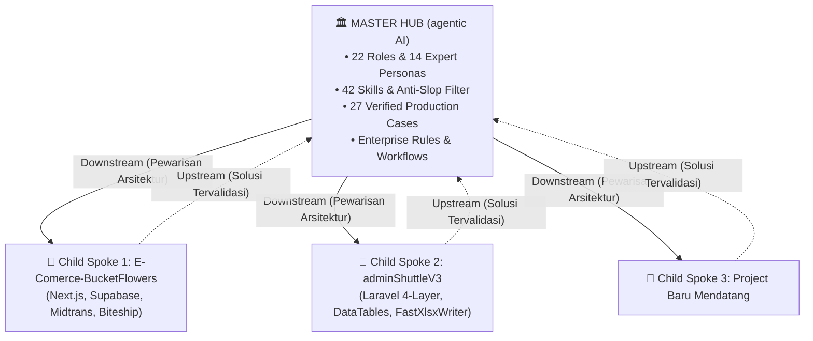

# Knowledge: Hub-and-Spoke Knowledge Sync Protocol

> **Universal Master Hub Protocol**: Dokumen ini mendefinisikan arsitektur dan tata kelola sinkronisasi pengetahuan antara repositori **Master Hub** (`agentic AI`) dan repositori proyek implementasi (**Child Spokes** seperti `E-Comerce-BucketFlowers`, `adminShuttleV3`, dll).

---

## 1. Arsitektur Hub-and-Spoke

### Identitas & Peran:
- **Pusat / Induk (`Master Hub`)**:
  - Repositori: `c:\Users\ASUS\Documents\Web Dev\improving\agentic AI`
  - Peran: *Single Source of Truth* arsitektur multi-agen, tata kelola OODA Loop, katalog 42 skill, basis pengetahuan Case-Bank terpusat, dan panduan rekayasa enterprise.
- **Cabang / Anak (`Child Spokes`)**:
  - Repositori: Proyek-proyek aplikasi nyata yang dikembangkan oleh pengguna dan agen.
  - Peran: Implementasi spesifikasi bisnis lokal (PRD toko online, sistem pemesanan tiket, configurator 3D, dll).

---

## 2. Arah Aliran Pengetahuan (Two-Way Flow)

### A. Downstream Flow (Master -> Child / Inisialisasi Proyek Baru)
Ketika proyek baru dibuat atau di-bootstrap:
1. Proyek anak menyalin arsitektur inti dari Master Hub:
   - 4-Tier Hirarki Peran (22 Spesialis) & 14 Expert Personas DNA.
   - Core Guardrails (`00-core-guardrails.md`) dan Workflow Discipline (`01-workflow-discipline.md`).
   - Anti-Slop Mandatory Delivery Gate (R-01 s.d R-38).
   - Scaffolding Stubs (Controller, Service, Repository).
2. Proyek anak menyesuaikan aturan lokal (*local rules precedence*) sesuai kebutuhan domain dan PRD spesifik proyek.

### B. Upstream Flow (Child -> Master / Penyerapan Solusi Produksi)
Ketika proyek anak menemukan bug kritis dan menyelesaikannya secara elegan di lingkungan produksi:
1. Kasus dicatat di `.agents/04-case-bank/cases/` proyek anak dengan status `VERIFIED`.
2. Solusi bernilai umum (tanpa kredensial rahasia) disinkronkan kembali (*upstream*) ke `04-case-bank/cases/` Master Hub.
3. Master Hub mendaftarkan kasus tersebut ke `04-case-bank/index.json` dan memutakhirkan `AGENTS.md`.

---

## 3. Manfaat untuk Proyek Baru di Masa Depan
Setiap pelajaran mahal yang pernah diselesaikan di proyek anak (seperti penanganan parameter casting enum PostgreSQL, kompatibilitas UTF-8 BOM pada Excel, proteksi IDOR order, atau race condition checkout COD) tersimpan permanen di Master Hub.

Saat memulai proyek baru ke-2, ke-3, dan seterusnya:
* Agen pada proyek baru langsung mewarisi seluruh database preseden dari `agentic AI`.
* Agen tidak akan pernah mengulangi bug yang sama yang pernah terjadi di proyek-proyek sebelumnya.
