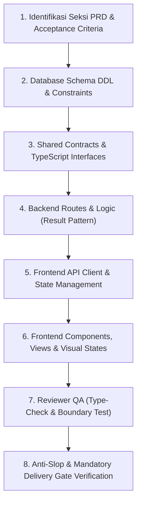

# New PRD Feature Workflow: Siklus Hidup Pembuatan Modul Berbasis Spesifikasi

> **Alur Kerja Pembuatan Modul Baru**: Panduan standar 8 tahapan untuk mengimplementasikan fitur atau modul baru dari Product Requirements Document (PRD) ke dalam sistem produksi dengan pemisahan tugas yang tegas.

---

---

## Rincian Tiap Tahapan:

### 1. Tahap 1 - Identifikasi Kebutuhan & Acceptance Criteria
- Baca detail seksi terkait pada dokumen PRD / spesifikasi produk.
- Kunci `locked_constraints` dan pastikan acceptance criteria tercatat di `implementation_plan.md`.

### 2. Tahap 2 - Database Schema & Constraints
- Rancang tabel, tipe kolom, indeks foreign key, dan enum.
- Wajib menyertakan proteksi RLS (*Row Level Security*) atau isolasi kueri soft-delete.
- Pastikan migrasi disiapkan secara statis dan backward-compatible.

### 3. Tahap 3 - Shared Contracts & Types
- Definisikan kontrak API dan antarmuka tipe data TypeScript/JSON schema bersama agar backend dan frontend berbagi tipe yang identik tanpa duplikasi manual.

### 4. Tahap 4 - Backend Routes & Service Layer
- Bangun endpoint dengan validasi input (*FormRequest / Zod*), guard clauses, dan *Result Pattern*.
- Pastikan logika bisnis diisolasi di Service Layer dan kueri database di Repository Layer.

### 5. Tahap 5 - Frontend API Client & State Management
- Hubungkan client fetch data dengan base URL dinamis.
- Kelola state persisten atau global menggunakan state manager (Zustand, Pinia, Vuex, Redux).

### 6. Tahap 6 - Frontend UI & Visual States
- Bangun komponen UI dengan design system yang telah disepakati.
- **Wajib memiliki 4 visual state lengkap**:
  1. *Loading Skeleton*
  2. *Empty State*
  3. *Data State*
  4. *Error Toast / Banner*

### 7. Tahap 7 - Reviewer QA Verification
- Builder dilarang me-review kodenya sendiri (*Reviewer Independence*).
- Jalankan pemeriksaan tipe (misal: `npm run type-check`) dengan target **0 error**.
- Lakukan boundary testing dan verifikasi endpoint.

### 8. Tahap 8 - Mandatory Delivery Gate
- Lakukan verifikasi 4-blok Anti-Slop (Hard Gate, Purpose-Gate, Liveliness, Craftsmanship) sebelum fitur diserahkan kepada pengguna.
